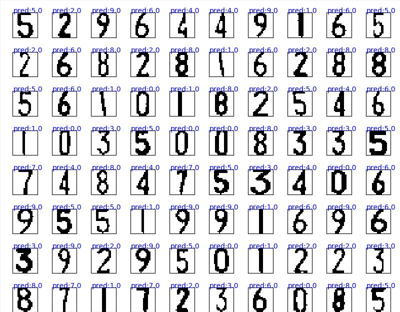

# perceptron
Realize license plate data classification

# 关于手写数字识别和车牌数据识别的几种方式

本文是作者入门深度学习的第一篇，主要讲解感知机和LeNet神经网络实现手写数字和车牌分类，未来将加入更多新的东西

 

 

# 关于环境

开发工具:pycharm
开发环境:win10

 

 

# 关于数据集

 

| 数据集 | 大小 | 
| :-----| ----: |
| MNIST | 28x28 | 
| 车牌 | 20x20 | 

 

# MNIST关于正确率

| 网络 | 训练准确率(20轮) |测试准确率(20轮)|
|--|--|--|
| 隐藏层1 = 256 | 81.0% |79.6%|
| 隐藏层1 = 300 |91.5%  |91.3%|
| 隐藏层1 = 256，丢弃层1丢弃概率0.2 |93.0%  |95.4%|
| 隐藏层1 = 300，隐藏层2 = 128 | 100% |98.3%|
| 隐藏层1 = 256，丢弃层1丢弃概率0.2；隐藏层2 = 128 | 99.4% |98.3%|
| LeNet | 98.0% |98.2%|

 

 

# 关于文件

| 文件 | 说明 | 
| :-----| ----: |
| Train | 车牌训练集 | 
| Test | 车牌测试集 | 
| nnMNIST | LeNet实现手写数字识别 | 
| nnPlate | LeNet实现车牌识别 | 
| pcMNIST | 实现手写数字识别 | 
| pcPlate | 实现车牌识别 | 

 

 

# 关于运行结果

### 使用LeNet5实现车牌20x20的识别

 

 

# 关于版本

v1.0

1.提供多层感知机和LeNet神经网络模型实现手写数字识别和车牌识别

 

 

# 关于未来

本文车牌数据集目前支持20x20，有许多缺陷，未来的更新方向包括

 - 增加32x32数据集大小的支持
 - 提供更多数据集，比如中文和字母
 - 提供svm分类车牌
 - 等等.

